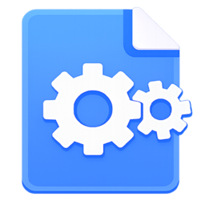

  

<h1 align="center">Мультифора</h1>

Пакетное переименование, конвертация и обработка файлов в Windows.

  
  
  
  
  

Мультифора — бесплатное настольное приложение с открытым исходным кодом для массовой работы с документами и изображениями. Оно объединяет очередь файлов, предварительный просмотр результатов и несколько операций в одном интерфейсе.

> Перед заменой исходных файлов сделайте резервную копию. Проверяйте предварительный результат, особенно при переименовании и конвертации.

## Возможности

- пакетное переименование по готовым и пользовательским шаблонам;
- нумерация, даты, EXIF, размеры изображений, замена текста и регулярные выражения;
- конвертация документов и изображений;
- объединение PDF и DOCX;
- сжатие PDF и изображений;
- добавление файлов кнопками, перетаскиванием, аргументами запуска и через меню Проводника;
- поиск, фильтрация, сортировка и ручное изменение порядка файлов;
- светлая, тёмная и системная темы;
- сохранение профилей операций, история переименований и проверка обновлений.

## Установка

1. Откройте [последний выпуск](https://github.com/VseMirka200/multifora/releases/latest).
2. Скачайте `Multifora-Setup-<версия>.exe`.
3. Запустите установщик и откройте Мультифору через меню «Пуск».

Для переносного запуска скачайте ZIP-архив, распакуйте его полностью и запустите `Multifora.exe`. Контрольные суммы SHA-256 публикуются рядом с файлами выпуска.

### Дополнительные компоненты

Основные функции доступны сразу после установки. Для отдельных операций могут потребоваться:

- Microsoft Word — для работы с некоторыми документами DOC и преобразования документов с сохранением сложного оформления;
- [Ghostscript](https://ghostscript.com/releases/gsdnld.html) — для сжатия PDF.

## Быстрый старт

1. Добавьте файлы или папку в очередь.
2. Откройте нужную вкладку операции.
3. Настройте параметры и проверьте результат.
4. Запустите обработку и подтвердите действие.

## Документы репозитория

- [Участие в проекте](docs/CONTRIBUTING.md)
- [Политика безопасности](docs/SECURITY.md)
- [Кодекс поведения](docs/CODE_OF_CONDUCT.md)
- [Лицензия MIT](LICENSE)

## Лицензия

Мультифора распространяется по лицензии [MIT](LICENSE). Вы можете использовать, изменять и распространять код при сохранении текста лицензии и уведомления об авторских правах.
